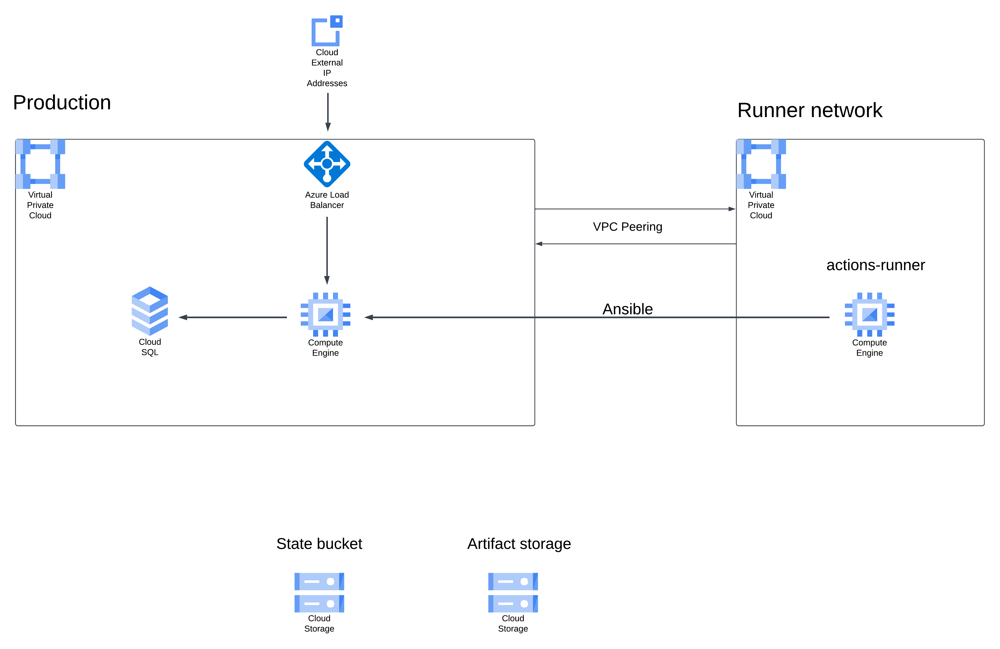

# Infrastructure deployment automation

Contents of this repository represent an infrastructure deployment solution that I developed for a project.  

**List folders and their contents:**
* `.github` - Pipelines for infrastructure deployment and configuration  

* `ansible` - Ansible configuration and a playbook for installing Docker on provisioned virtual machines

* `modules` - Collection of reusable Terraform modules

* `core` - Terraform configuration used to define the right-hand side of the architecture diagram, meaning **actions-runner**, **Runner network** and **Artifact storage**

* `dev` - Terraform configuration used to define infrastructure used for running the actual application
  
 

---

### Infrastructure design

**NOTE: It should be a GCP load balancer in the diagram, not Azure.**  

Also note that the bucket containing Terraform state is supposed to be provisioned manually. So it won't be found in any Terraform file here.

There were two possible design decisions:  
1. Put the self-hosted runner (**actions-runner** virtual machine) in the same network as the rest of the infrastructure 
2. Put self-hosted runner in a separate network  

The choice about splitting the infrastructure into two parts, namely `core` and `dev`, was made due to two reasons:  
1. **Modularity:** If the runner resided in the application's network, each additional network would require deploying a new runner inside it.
2. **Security:** If we have to change the configuration of the network where the application resides, will not affect the runner's network configuration  

